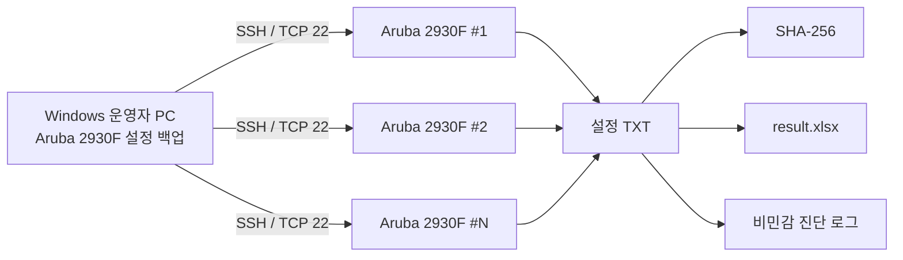

# Aruba 2930F 설정 백업

[](https://github.com/sebia1993/aruba-2930f-config-backup/actions/workflows/ci.yml)
[](LICENSE)

**ArubaOS-Switch 기반 Aruba 2930F 여러 대의 `running-config`를 SSH로 일괄 수집하는 Windows용 읽기 전용 네트워크 자동화 도구입니다.**

반복적인 장비 접속과 수동 설정 백업을 줄이고, **장비 식별 → 안전한 CLI 수집 → 실패 격리 → 결과 무결성 확인 → 보고서 생성**을 하나의 운영 절차로 묶는 것을 목표로 합니다.

> 현재 배포 버전은 **v0.1.8 사전릴리즈**입니다. 단위 테스트, 가상/루프백 SSH 검증, Windows 패키지 점검, SHA-256 및 SBOM 검증을 자동화했습니다. 실제 Aruba 2930F 현장 검증은 [검증 보고서](docs/VALIDATION_REPORT.md)에서 별도로 관리합니다. `main`의 RSA/SHA-1 차단 보완은 v0.1.8 바이너리에 포함되지 않았으므로 [의존성 감사 예외](docs/DEPENDENCY_AUDIT_EXCEPTIONS_KO.md)의 배포 경계를 확인하십시오.

## 포트폴리오 요약

| 채용 관점 | 내용 |
|---|---|
| 해결한 문제 | 여러 스위치에 반복 접속해 설정을 백업하고 결과를 수작업으로 정리하던 과정을 하나의 Windows 도구로 표준화 |
| 담당 범위 | 문제 정의, Windows GUI, SSH 안전 경계, 장비 식별, 결과 무결성, 패키징, 테스트와 CI/CD |
| 핵심 판단 | 빠른 수집보다 **잘못된 장비·바뀐 SSH 지문·불완전한 출력에서 멈추는 것**을 우선 |
| 검증 증거 | v0.1.8 기준 374개 테스트 통과, Windows CI, 배포 ZIP·SHA-256·CycloneDX SBOM 독립 검증 |
| 증거의 한계 | 자동 테스트와 합성 SSH 검증 결과이며, 실제 운영 장비·업무 성과 수치로 해석하지 않음 |

## 채용 검토자를 위한 읽는 순서

[포트폴리오 검토 안내](docs/PORTFOLIO_REVIEW_KO.md)에서 **설계 질문 → 실제 코드 → 실패 사례 테스트 → 장비 없는 재현 → 검증 한계** 순서로 확인할 수 있습니다. 아래 운영 설명과 함께 읽으면 기능 주장과 공개 근거를 대조할 수 있습니다.

## 한눈에 보기

| 항목 | 내용 |
|---|---|
| 대상 장비 | Aruba 2930F / 2930F VSF |
| 네트워크 OS | ArubaOS-Switch |
| 접속 방식 | SSH, 기본 TCP 22 |
| 수집 명령 | `show running-config` |
| 장비 변경 | **없음 — 설정 모드에 진입하지 않음** |
| 사전 확인 | SSH 장비 지문, EXEC 프롬프트, `no page`, 모델/SKU |
| 동시 처리 | 기본 10대, 최대 20대 |
| 실패 처리 | 장비 단위 격리, 5/15/30초 지연 재시도 |
| 결과 | 장비별 TXT, SHA-256, `result.xlsx`, 비민감 진단 로그 |
| 실행 환경 | Windows x64, Python 설치 불필요한 배포 ZIP |

## 해결하려 한 운영 문제

여러 대의 액세스 스위치 설정을 사람이 직접 백업하면 다음 문제가 반복될 수 있습니다.

- 장비마다 접속해 동일한 명령을 반복해야 함
- 페이지 출력 때문에 설정 일부가 누락될 수 있음
- 잘못된 장비에 접속했는지 사람이 직접 판단해야 함
- 일부 장비의 일시적인 SSH 장애가 전체 작업 흐름을 방해할 수 있음
- 수집 파일과 성공/실패 결과를 별도로 정리해야 함
- 저장된 설정 파일이 온전한지 확인할 근거가 부족함

이 프로젝트는 단순히 SSH 명령을 반복하는 것이 아니라, **운영 과정에서 발생할 수 있는 실패와 오인 가능성까지 함께 제어하는 것**을 설계 목표로 삼았습니다.

## 핵심 설계 판단

| 운영 문제 | 설계 판단 |
|---|---|
| 페이지 출력으로 설정 누락 가능 | 모든 연결에서 `no page`를 먼저 적용하고 정상 응답을 확인한 뒤 `show` 명령 실행 |
| 다른 장비에 잘못 접속할 가능성 | `show version` + `show modules`의 증거를 함께 확인한 뒤 2930F 계열에서만 설정 수집 |
| SSH 대상 장비가 바뀌었을 가능성 | 최초 SSH 장비 지문을 운영자가 검토하고, 승인된 지문이 변경되면 연결 차단 |
| 특정 장비 실패가 전체 작업에 영향 | 장비별 상태와 실패를 격리하고 제한된 동시 처리 적용 |
| 일시적인 통신 장애 | 즉시 반복 대신 5초 → 15초 → 30초 지연 재시도 |
| 인증/모델 오류 같은 영구 실패 | 동일 조건을 반복하지 않고 즉시 종료 |
| 백업 파일의 무결성 확인 | 장비별 설정 파일 저장 후 SHA-256 계산 |
| 운영망 변경 위험 | 설정 모드와 구성 변경 명령을 허용하지 않는 읽기 전용 흐름 유지 |
| 문제 재현 시 민감정보 노출 위험 | IP·계정·암호·설정 원문을 포함하지 않는 오류 분류와 오프라인 진단 코드 사용 |

설계 배경과 구성요소별 책임은 [프로그램 구조](docs/ARCHITECTURE.md)에 더 자세히 정리되어 있습니다.

## 동작 구조



장비 한 대에 대한 수집 순서는 다음과 같습니다.

```text
SSH 장비 지문 확인
        ↓
EXEC 프롬프트 확인
        ↓
no page 적용 및 검증
        ↓
show version
show modules
        ↓
Aruba 2930F / VSF 식별
        ↓
show running-config
        ↓
최종 프롬프트·출력 검증
        ↓
TXT 저장 + SHA-256 + Excel 결과 기록
```

## 실행 화면

아래 이미지는 **문서용 가상 IP와 가상 장비명만 사용해 프로그램 자체에서 생성한 예시 화면**입니다. 실제 운영망 주소, 계정, 설정 정보는 포함하지 않습니다.

### 작업 입력 화면


### 수집 완료 예시


## 지원 및 검증 범위

### 지원 범위

| 구분 | 상태 | 비고 |
|---|---|---|
| Aruba 2930F | 지원 | 모델/SKU 확인 후 설정 수집 |
| Aruba 2930F VSF | 지원 로직 | 복수 공식 SKU가 확인되는 구성 포함 |
| ArubaOS-Switch | 지원 대상 | 장비별 OS 차이는 현장 검증 필요 |
| SSH 암호 인증 | 지원 | 공통 계정 사용 |
| Enable 암호 | 선택 지원 | 필요한 환경에서만 사용 |
| IPv4 | 지원 | 현재 입력 대상 |
| Windows x64 | 지원 | 배포 ZIP 기준 |
| 다른 Aruba 모델 | 미지원 | 2930F 외 장비는 차단 |
| 설정 복원/변경 | 미지원 | 의도적으로 읽기 전용 |

### 검증 현황

| 검증 항목 | 상태 |
|---|---|
| 단위 테스트 | ✅ 자동 검증 |
| 가상/루프백 SSH 장비 | ✅ 자동 검증 |
| RSA/SHA-1 전용 SSH 인증 전 차단 | ✅ 자동 검증 |
| Windows 패키지 실행 점검 | ✅ 자동 검증 |
| 릴리즈 ZIP SHA-256 검증 | ✅ 자동 검증 |
| SBOM 생성 및 검증 | ✅ 자동 검증 |
| 문서용 UI 렌더링 | ✅ CI 검증 |
| 실제 Aruba 2930F 운영 장비 | ⚠️ 현장 검증 기록 필요 |
| 대규모 운영망 장시간 검증 | ⚠️ 현장 검증 기록 필요 |

자동 검증과 실제 장비 검증을 구분해 기록합니다. 실제 장비 테스트 항목, 합격 기준, 공개 가능한 증거 형식은 [VALIDATION_REPORT.md](docs/VALIDATION_REPORT.md)에 정의했습니다.

## 빠른 시작

1. GitHub **Releases**에서 `Aruba2930FConfigBackup_v0.1.8_windows_x64.zip`과 같은 Windows x64 ZIP을 받습니다.
2. 함께 제공되는 `.sha256` 파일로 ZIP 해시를 확인합니다.

```powershell
Get-FileHash .\Aruba2930FConfigBackup_v0.1.8_windows_x64.zip -Algorithm SHA256
Get-Content .\Aruba2930FConfigBackup_v0.1.8_windows_x64.zip.sha256
```

3. ZIP 전체를 쓰기 가능한 로컬 폴더에 압축 해제합니다.
4. `Aruba2930FConfigBackup\Aruba2930FConfigBackup.exe`를 실행합니다.
5. 장비 IP, SSH 계정, 동시 접속 수를 입력한 뒤 **백업 시작**을 누릅니다.
6. 처음 보는 장비의 SSH 장비 지문은 실제 관리 정보와 대조한 뒤 승인합니다.
7. 완료 후 장비별 TXT와 `result.xlsx`를 확인합니다.

> EXE만 ZIP에서 따로 꺼내 실행하지 마십시오. 현재 사전릴리즈는 Authenticode 서명이 없어 Windows SmartScreen 경고가 표시될 수 있습니다.

## 장비에서 실행되는 핵심 명령

```text
no page
show version
show modules
show running-config
```

- `no page`가 정상 적용되지 않으면 이후 `show` 명령을 실행하지 않습니다.
- `show version`과 `show modules`를 함께 사용해 2930F 계열 여부를 확인합니다.
- 2930F 식별이 끝난 뒤 `show running-config`를 한 번 실행합니다.
- `(config)#`와 같은 설정 모드 프롬프트는 허용하지 않습니다.

프롬프트 처리, 출력 한도, SSH 알고리즘 차단 등 상세 동작은 [SSH 수집 및 운영 안전](docs/SSH_AND_SAFETY.md)을 참고하십시오.

## 결과 파일

기본 저장 경로:

```text
%USERPROFILE%\Documents\Aruba2930FConfigBackup\backup\YYYY-MM-DD\HHmmss\
├── <hostname>.txt
├── <ip>.txt
├── <hostname>(<ip>).txt
├── operation.jsonl
└── result.xlsx
```

파일 이름은 실행 시 **장비 이름 / IP / 장비 이름(IP)** 중 하나를 선택할 수 있습니다. 장비 이름을 확인할 수 없으면 IP를 사용합니다.

`result.xlsx`에는 다음 운영 결과가 기록됩니다.

- 장비 주소
- 확인된 호스트명과 모델/SKU
- 성공/실패 상태
- SSH 장비 지문 확인 및 백업 시도 횟수
- 전체 연결 시도 횟수
- 소요 시간
- 백업 파일 경로
- SHA-256
- 오류 분류
- 오프라인 진단 코드

백업 TXT에는 실제 장비 설정이 포함되므로 조직의 설정 파일 보관 정책에 따라 보호해야 합니다.

## 운영 안전 원칙

- 장비 설정을 변경하지 않음
- 설정 모드에 진입하지 않음
- 모델 확인 전에 `show running-config`를 실행하지 않음
- 새 SSH 장비 지문은 운영자가 검토
- 승인된 장비 지문이 변경되면 연결 차단
- 암호와 Enable 암호를 파일에 저장하지 않음
- 미완성 백업 파일을 정상 결과로 처리하지 않음
- 릴리즈 ZIP의 SHA-256과 빌드 출처를 검증

세부 정책은 [SSH 수집 및 운영 안전](docs/SSH_AND_SAFETY.md)과 [SECURITY.md](SECURITY.md)를 참고하십시오.

## 재시도 정책

일시적인 네트워크 오류와 명령 시간초과처럼 재시도 가능한 실패에만 적용합니다.

| 시도 | 실행 시점 |
|---|---|
| 1차 | 즉시 |
| 2차 | 첫 실패 후 5초 |
| 3차 | 두 번째 실패 후 15초 |
| 4차 | 세 번째 실패 후 30초 |

인증 실패, SSH 장비 지문 변경, 미지원 모델처럼 동일 조건에서 반복해도 의미가 없는 오류는 즉시 종료합니다.

## 현재 범위 밖

- 예약 실행 및 Windows 서비스/에이전트 모드
- Excel/CSV 장비 목록 가져오기
- 장비별 서로 다른 계정
- SSH 개인 키 인증
- IPv6 및 DNS 호스트명 입력
- 설정 비교 및 변경 탐지
- 설정 복원
- 장비 설정 변경
- Aruba 2930F 이외 모델

## 상세 문서

| 문서 | 내용 |
|---|---|
| [ARCHITECTURE.md](docs/ARCHITECTURE.md) | 프로그램 구성, 수집 단계, 결과 생성 흐름 |
| [VALIDATION_REPORT.md](docs/VALIDATION_REPORT.md) | 자동/실장비 검증 항목, 합격 기준, 검증 기록 |
| [SSH_AND_SAFETY.md](docs/SSH_AND_SAFETY.md) | 프롬프트, `no page`, 모델 식별, SSH 알고리즘, 안전 경계 |
| [DEPENDENCY_AUDIT_EXCEPTIONS_KO.md](docs/DEPENDENCY_AUDIT_EXCEPTIONS_KO.md) | Paramiko 감사 예외, 보완 통제, 재검토 기한과 제거 조건 |
| [ERROR_CODES.md](docs/ERROR_CODES.md) | 오류 코드와 1차 확인 방향 |
| [TROUBLESHOOTING.md](docs/TROUBLESHOOTING.md) | 현장 적용 시 점검 순서와 대표 문제 |
| [RELEASE_POLICY.md](docs/RELEASE_POLICY.md) | 버전·릴리즈·검증 원칙 |
| [DEVELOPMENT.md](DEVELOPMENT.md) | 개발 환경, 테스트, 유지관리 규칙 |
| [SECURITY.md](SECURITY.md) | 취약점 제보와 보안 정책 |
| [CHANGELOG.md](CHANGELOG.md) | 버전별 상세 변경 이력 |

## 개발 및 검증

소스 실행에는 Windows x64와 CPython 3.14가 필요합니다.

```powershell
py -3.14 -m venv .venv
.\.venv\Scripts\python.exe -m pip install --upgrade pip
.\.venv\Scripts\python.exe -m pip install `
  -r .\requirements-lock.txt -r .\requirements-dev.txt
.\.venv\Scripts\python.exe -m pip install --no-deps -e .
.\.venv\Scripts\python.exe -m aruba2930f_backup
```

저장소 전체 검증:

```powershell
powershell -ExecutionPolicy Bypass -File .\tools\validate.ps1 `
  -PythonPath .\.venv\Scripts\python.exe
```

## 함께 보는 네트워크 자동화 프로젝트

| 프로젝트 | 보여주는 역량 |
|---|---|
| [Aruba Cluster Health Dashboard](https://github.com/sebia1993/aruba-cluster-health-dashboard) | 여러 장비 관측값의 상관분석과 장애·수집 실패 구분 |
| [HPE Comware Change Validator](https://github.com/sebia1993/hpe-comware-change-validator) | 작업 전·후 상태 비교와 위험도 분류 |
| [Aruba MM Session Cleanup](https://github.com/sebia1993/aruba-mm-session-cleanup) | 상태 변경 자동화의 승인·대상 고정·사후 검증 |

## 라이선스와 보안 제보

MIT License로 배포됩니다. 취약점은 공개 Issue에 장비 주소, 설정 또는 자격증명을 올리지 말고 [SECURITY.md](SECURITY.md)의 절차로 제보하십시오.
