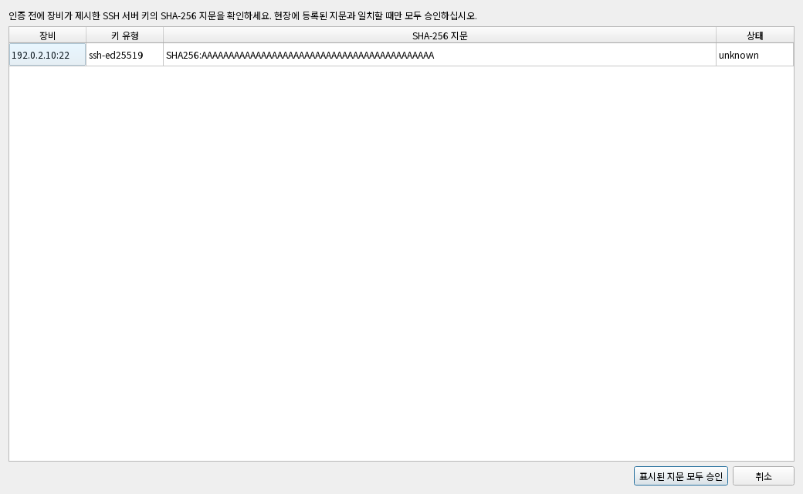
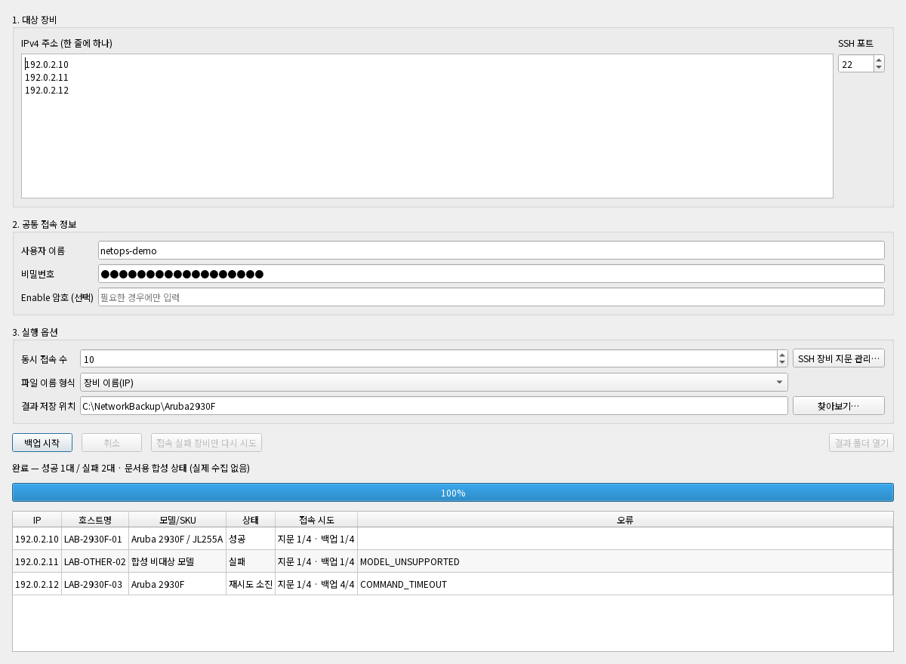

# 화면으로 따라가는 Aruba 2930F 설정 백업

실제 PySide6 앱 창에 문서용 합성 입력·상태를 넣어 캡처했다. 화면의 성공·실패는 수집 서비스를 실행한 결과가 아니다. 아래 순서는 사용 방법을 설명하며, 이번 캡처에서는 장비 연결과 SSH 지문 승인을 수행하지 않았다.

## 1. 백업 범위와 저장 위치 확인

- **행동:** 장비 IP를 한 줄에 하나씩 입력하고 SSH 포트, 계정, 동시 실행 수, 결과 폴더를 확인한다.
- **읽을 값:** 예제 대상은 `192.0.2.10`~`.12` 3대다. 암호는 마스킹된다.
- **주의·다음 행동:** 입력 대수와 승인된 백업 범위를 대조한 후 실행한다. 문서의 `netops-demo`와 마스킹된 값은 사용 가능한 운영 계정이 아니다.

## 2. 최초 SSH 지문을 별도 경로로 대조

- **행동:** 장비 주소, 키 유형, SHA-256 지문을 장비 관리자가 제공한 값과 대조한다.
- **읽을 값:** `unknown`은 아직 신뢰 저장소에 등록하지 않은 키다. 그림의 반복된 `A` 지문은 문서용 가상 값이다.
- **주의·다음 행동:** 지문이 일치할 때만 승인한다. 저장된 키가 바뀐 경우는 일반 신규 승인과 다르며 실행을 차단한다. 이번 캡처는 실제 `HostKeyApprovalDialog`를 표시한 뒤 취소했다.

## 3. 완료된 장비와 시도 횟수 확인

- **행동:** 결과 표에서 장비 IP·모델·상태·시도 횟수를 함께 확인한다.
- **읽을 값:** 예제 `.12`는 백업 `2/4`로 표시한다. 재시도 없이 성공한 경우와 구분하기 위한 합성 상태다.
- **주의·다음 행동:** 정상 결과만 확인한 뒤 생성된 백업과 Excel 요약을 열어 필요한 파일이 있는지 대조한다. 진행률 100%만으로 전체 성공을 판단하지 않는다.

## 4. 혼합 결과에서는 실패 장비를 따로 확인

- **행동:** 성공 1대·실패 2대의 상태와 오류 코드를 읽는다.
- **읽을 값:** `MODEL_UNSUPPORTED`는 모델 검증 경계, `COMMAND_TIMEOUT`과 백업 `4/4`는 재시도 소진 예시다.
- **주의·다음 행동:** 모델 차단을 해제하려고 무조건 재실행하지 않는다. 대상 모델을 확인하고, 타임아웃 장비는 연결·명령 응답과 진단 정보를 확인한 다음 재실행 범위를 정한다. [문제 해결](TROUBLESHOOTING.md)와 [오류 코드](ERROR_CODES.md)를 함께 읽는다.

## 캡처 출처와 재현

- 앱 버전: `0.1.8`. 캡처 OS: Windows GitHub Actions, Python 3.14, Qt offscreen + Noto Sans KR.
- 캡처 소스 SHA: `11db79d33f98c01cb923ef9544f9d3792d45472f`. [Windows 캡처 실행](https://github.com/sebia1993/aruba-2930f-config-backup/actions/runs/34175884087).
- 전체 메타데이터: [capture-manifest.json](images/capture-manifest.json). PNG별 SHA-256도 이 파일에 기록한다.
- 도구: [render_docs_screenshots.py](../tools/render_docs_screenshots.py), [Windows 캡처 workflow](../.github/workflows/docs-screenshots.yml).
- 합성 입력: RFC 5737 주소·LAB 장비명·가상 지문. 실제 장비·계정 접속 없음. 소켓 연결 시도는 도구에서 차단한다.

Windows에서 저장소의 잠금 의존성 설치 후 `python tools/render_docs_screenshots.py --output artifacts/docs-screenshots`로 재현한다. 한글 폰트까지 같은 조건은 workflow가 구성한다. macOS Qt offscreen에서도 렌더링할 수 있으나 Windows 캡처와 구분한다. 이 자료는 GUI 상태 표시의 증거이며 실제 장비 성공률이나 현장 호환성의 증거는 아니다.
